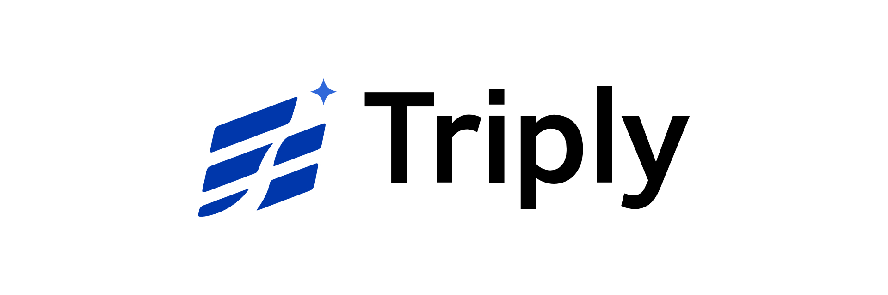

# Triply

## 세 가지 기준으로 완성하는 나만의 여행

순천향대학교 2026학년도 1학기 웹프로그래밍 기말 과제

### 브랜드 콘셉트

Triply는 여행을 단순한 목적지 선택이 아니라, 취향과 상황, 목적이 함께 맞아떨어질 때 완성되는 경험으로 바라봅니다.

- Triply의 Triple(3중) 의미를 시각적으로 표현했습니다.
- 여행을 구성하는 3가지 요소가 결합되어 하나의 목적지로 향하는 흐름을 담았습니다.
- 삼중 선을 핵심 그래픽 요소로 사용해 이동, 방향성, 연결성을 강조했습니다.
- 여백이 이어지며 우측 상단의 별로 향하는 느낌을 통해 완성되는 여행의 이미지를 표현했습니다.

### 프로젝트 구성

| 페이지 | 구성 내용 |
| --- | --- |
| `index.html` | 메인 배너, 오늘의 추천 여행지, 테마별 추천, 실시간 인기 여행지, 소개 섹션 |
| `detail.html` | 여행지별 상세 소개, 추천 코스, 여행 포인트 |
| `all-destinations.html` | 전체 여행지 목록과 각 여행지별 상세 페이지 링크 |
| `signin.html` | 로그인 폼과 계정 관련 링크 |
| `signup.html` | 회원가입 폼, 입력 검증, 약관 동의 |

- 메인 화면의 배너 여행지 4곳 위에 마우스 커서가 올라가면 텍스트가 사라지고 사전에 만들어 둔 svg가 표시되도록 해 텍스트가 바뀌는 효과를 구현했습니다.
- 로고 및 여행지 헤더 텍스트 등 디자인이 필요한 텍스트에는 Gmarket Sans, 본문에는 Pretendard GOV 서체를 사용했습니다.
- 두 서체 모두 SIL Open Font License에 따라 개인 또는 기업이 영리적, 비영리적 목적으로 자유롭게 사용할 수 있습니다.
    - Gmarket Sans: https://corp.gmarket.com/fonts/
    - Pretendard GOV: https://github.com/orioncactus/pretendard/tree/main/packages/pretendard-gov

### 프로젝트 파일

- `resources/css/` : 공통 스타일과 페이지별 스타일
- `resources/fonts/`: 페이지에 사용된 서체
- `resources/images/` : 로고, 배너, 여행지 이미지
- `TriplyBrand/` : 브랜드 로고 원본 에셋

### 참고

- 헤더와 메인 소개 영역에 Triply 로고를 적용했습니다.
- Triply 브랜드는 ChatGPT의 이미지 생성 기능을 사용해 초안을 제작하고 이후 Affinity Studio를 사용해 벡터 그래픽을 제작했습니다.
- 이미지 중 이름에 "_SDR"이 있는 이미지는 원본 이미지에 HDR이 적용되어 있는 경우입니다. 이 경우 "_SDR"이 있는 이미지를 페이지에 적용했습니다.